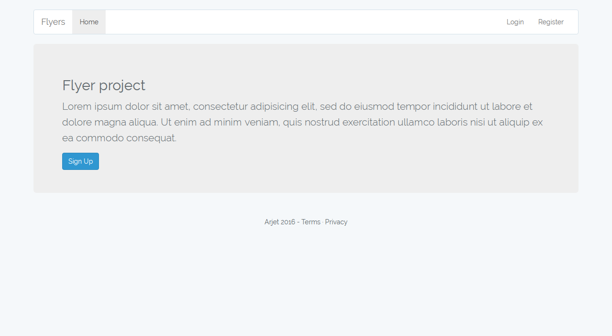
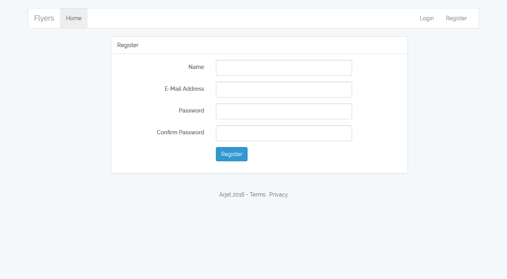
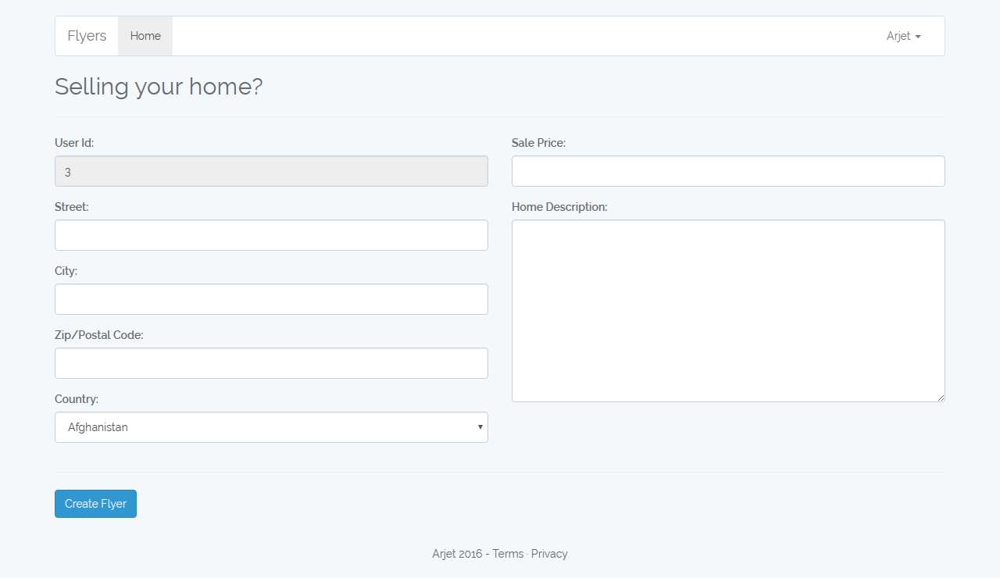
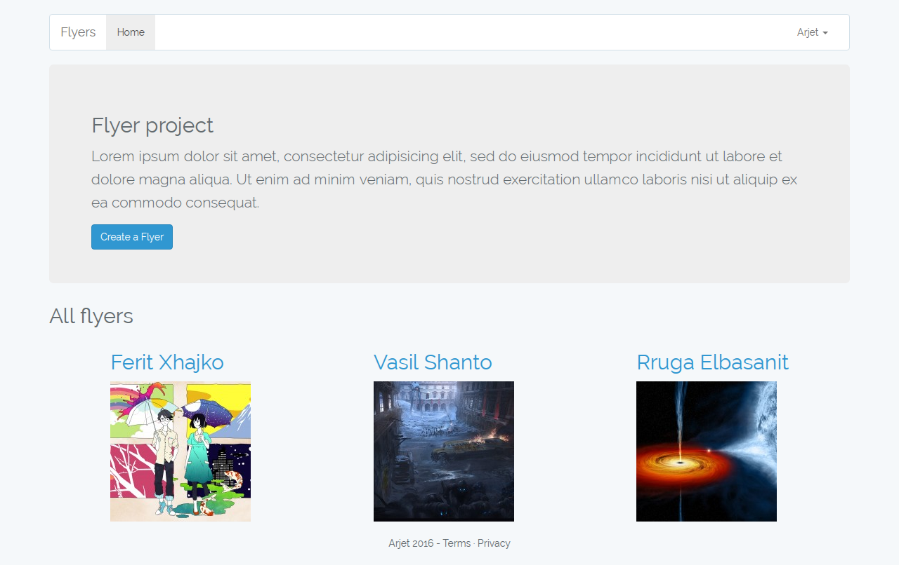
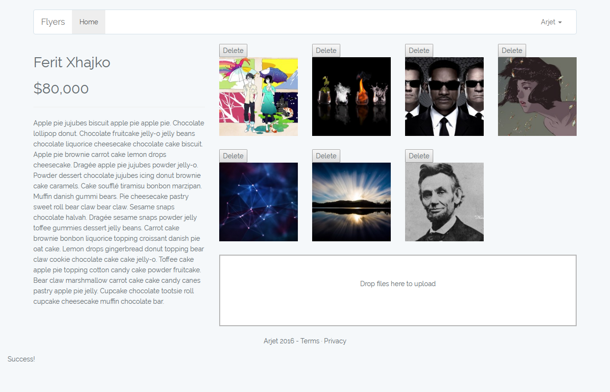

# Flyer project

Add and edit your flyers with user authentication and guards, validations, advanced flashing and more...

To use this repo clone it to your computer, modify .env according to your database, run "composer install", "php artisan migrate" and then "php artisan serve" or use homestead for easy mode deployment.

